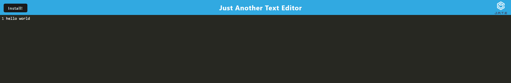

# theTextEditor

## Description

This app allows someone to create notes or code snippets with or without an internet connection
and they can reliably retrieve them for later use.

## Installation

Navigate to https://obscure-badlands-61191.herokuapp.com/, click the install button. One is able to use the app without installing, but only in the browser. 

## Usage

Simply enter text or code snippets. The text will remain even after refreshing the page. 

## Credits

Used past assignments to help with code. My tutor and TAs also helped a great deal. 

github: 
deployed site: https://obscure-badlands-61191.herokuapp.com/ 